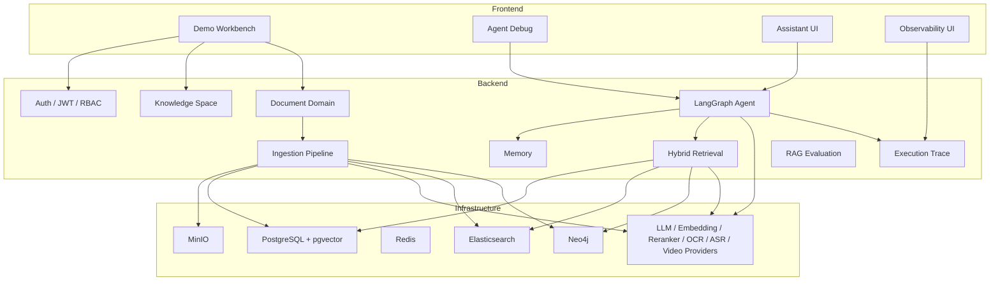

# Enterprise Agentic RAG

Enterprise Agentic RAG 是一个面向企业知识库问答的 Agentic RAG MVP。项目采用 monorepo 结构，覆盖文档入库、混合检索、GraphRAG、Agent 编排、权限隔离、可观测性、评估与前端演示工作台。

当前目标不是商业化完整平台，而是一个可部署、可演示、可写进简历并能解释架构取舍的工程化 MVP。

## Demo Quick Start

```bash
pnpm install
cp .env.example .env
pnpm docker:up
pnpm db:migrate
pnpm db:seed
pnpm demo:seed
pnpm provider:smoke
pnpm dev
```

默认地址：

```text
Backend: http://localhost:3000
Frontend: http://localhost:3001
```

默认账号：

```text
email: admin@example.com
password: Admin123!
```

详细演示脚本见 [docs/demo/DEMO_SCRIPT.md](docs/demo/DEMO_SCRIPT.md)。

## Architecture



## Core Pipelines

### Document Ingestion

```text
Upload
-> StorageService / MinIO
-> DocumentProcessingService
-> Parser + Cleaner + Metadata
-> DocumentContent
-> ChunkService
-> EmbeddingService
-> VectorService / pgvector
-> SearchService / Elasticsearch
-> optional Knowledge Graph extraction
```

### Retrieval

```text
Question
-> Vector Retriever
-> Keyword Retriever
-> Graph Retriever
-> Permission Filter
-> RRF Fusion
-> Reranker
-> Context Builder
-> ContextChunk[]
```

### Agent

```text
START
-> Memory Node
-> Planner Node
-> Retrieval Node
-> Graph Node
-> Answer Node
-> Verification Node
-> END
```

## Implemented Capabilities

- Monorepo: `apps/backend` + `apps/frontend`
- Unified config system with zod env validation
- JWT login, guard, current-user decorator
- Lightweight RBAC and request execution context
- Knowledge Space aggregate root
- Document domain and object storage layer
- Document upload, processing, cleaner, metadata, pipeline event/job
- Semantic chunking and embedding pipeline
- PostgreSQL pgvector vector retrieval
- Elasticsearch BM25 keyword retrieval
- Neo4j Knowledge Graph / GraphRAG
- Hybrid Retrieval with RRF, reranker, context token budget
- Conversation, message, Redis short-term memory, summary memory, Mem0 provider boundary
- LangGraph Agent runtime with Tool Registry and loop planning / verification
- Production Agent API and SSE streaming
- Execution trace store, timeline API, metrics, readiness
- Tenant / organization / department model and tenant-aware RBAC
- Data permission policy with security level and department filtering
- Multimodal provider boundary for OCR / ASR / Video and multimodal document indexing
- Frontend Demo Workbench, Agent Debug, Assistant, Observability panels
- Docker Compose packaging and demo scripts
- RAG evaluation scaffolding

## Explicit Non-Goals

The MVP intentionally does not implement:

- Multi-Agent collaboration
- Autonomous Agent
- External tool calling / function calling
- Graph visualization editor
- Commercial admin permission UI
- Distributed job queue
- Full OCR layout analysis, speaker diarization, or local video frame extraction

## Project Structure

```text
apps/
  backend/
    prisma/
    src/
      common/
      config/
      infrastructure/
      modules/
  frontend/
    app/
    components/
    services/
    store/
    types/
docs/
  demo/
  evaluation/
  tasks/
docker/
```

## Environment

Use `.env.example` as the local template.

Important provider groups:

```text
LLM_API_URL
LLM_API_KEY
LLM_MODEL

EMBEDDING_API_URL
EMBEDDING_API_KEY
EMBEDDING_MODEL
EMBEDDING_DIMENSION

RERANKER_API_URL
RERANKER_API_KEY
RERANKER_MODEL

OCR_PROVIDER
ASR_PROVIDER
VIDEO_PROVIDER
```

OCR / ASR / Video default to `metadata` fallback. Set them to `openai-compatible` only when a real provider endpoint is available.

## Commands

```bash
pnpm format:check
pnpm lint
pnpm typecheck
pnpm build
pnpm db:validate
pnpm db:migrate
pnpm db:seed
pnpm demo:seed
pnpm provider:smoke
pnpm demo:smoke <userId> <conversationId> "单笔超过10000元的报销需要谁审批？" <spaceId>
```

Production compose:

```bash
cp .env.production.example .env.production
pnpm docker:prod:config
pnpm docker:prod:build
pnpm docker:prod:up
pnpm db:deploy
pnpm db:seed
```

Deployment checklist: [docs/demo/DEPLOYMENT_CHECKLIST.md](docs/demo/DEPLOYMENT_CHECKLIST.md)

## Demo Assets

- Demo script: [docs/demo/DEMO_SCRIPT.md](docs/demo/DEMO_SCRIPT.md)
- Provider smoke guide: [docs/demo/PROVIDER_SMOKE.md](docs/demo/PROVIDER_SMOKE.md)
- Sample policy: [docs/demo/sample-policy.md](docs/demo/sample-policy.md)
- Sample dataset: [docs/demo/sample-dataset.json](docs/demo/sample-dataset.json)
- Screenshot shot list: [docs/demo/SCREENSHOT_SHOTLIST.md](docs/demo/SCREENSHOT_SHOTLIST.md)
- Resume description: [docs/demo/RESUME_PROJECT.md](docs/demo/RESUME_PROJECT.md)

## Architecture Rules

- Controller does not access Prisma, Redis, Neo4j, MinIO SDK, or model providers.
- Service coordinates business use cases and calls repositories/providers/infrastructure services.
- Repository owns database access.
- Infrastructure layer owns external SDKs and low-level clients.
- Agent receives text/context only, never raw binary files.
- Retrieval must pass tenant and access-policy filtering before results become context.
- Logs, metrics, smoke reports, and screenshots must not expose secrets, full prompts, full answers, or full document content.

## Verification Status

The standard verification suite is:

```bash
pnpm format:check
pnpm lint
pnpm typecheck
pnpm build
pnpm db:validate
```

For a deployable demo, also run:

```bash
pnpm db:deploy
pnpm db:seed
pnpm demo:seed
pnpm provider:smoke
```
