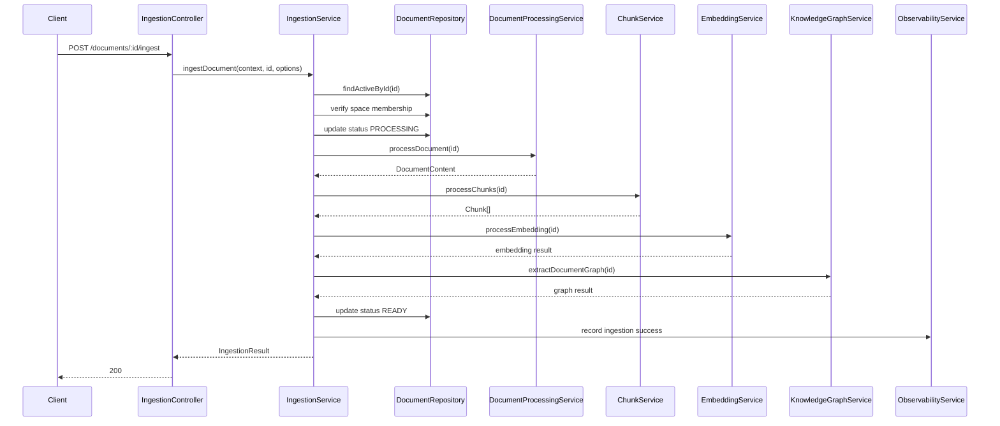
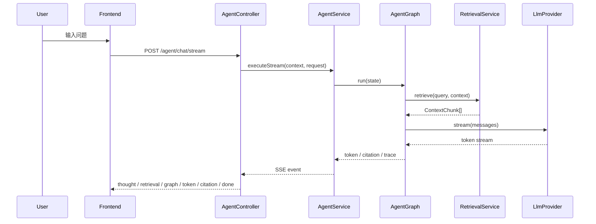

# TASK-026 Sequence

## 正常流程：单文档入库



## 正常流程：Space 批量入库

```text
POST /spaces/:spaceId/ingest
-> 校验当前用户是 OWNER 或 EDITOR
-> 查询 Space 下可处理 Document
-> 按顺序调用 ingestDocument()
-> 每个 Document 独立记录 stage
-> 返回成功和失败列表
```

推荐第一版采用顺序处理，不并发。

原因：

- 避免本地 Demo 同时压爆 LLM / Embedding / Reranker 服务。
- 避免 Windows / Docker Desktop 环境中出现资源抖动。
- 便于定位失败阶段。

## 文档状态流转

```text
CREATED
-> PROCESSING
-> READY
```

失败：

```text
CREATED / PROCESSING / READY
-> FAILED
```

重新入库：

```text
READY / FAILED
-> PROCESSING
-> READY
```

重新入库必须要求：

```text
force=true
```

## Stage 流程

### validate

检查：

- Document 存在。
- Document 未归档。
- 当前用户对 Space 有 OWNER 或 EDITOR 权限。
- Document 有 `storageKey`。
- Document type 是当前 parser 支持的类型。

第一版支持：

```text
PDF
WORD
TXT
MARKDOWN
```

不支持：

```text
IMAGE
AUDIO
VIDEO
```

这些类型由后续 OCR / ASR / Video Understanding 任务接入。

### document-processing

执行：

```text
StorageService.getObject
-> ParserFactory
-> DocumentContent upsert
```

该阶段复用 `DocumentProcessingService`。

### chunking

执行：

```text
DocumentContent
-> MarkdownHeaderSplitter
-> TokenSplitter
-> ChunkRepository.createMany
```

该阶段复用 `ChunkService`。

### embedding

执行：

```text
Chunk[]
-> EmbeddingProvider
-> VectorService
-> ChunkEmbedding
```

该阶段复用 `EmbeddingService`。

### graph-extraction

执行：

```text
Chunk[]
-> EntityExtractor
-> RelationExtractor
-> KnowledgeGraphRepository
-> Neo4j
```

该阶段复用 `KnowledgeGraphService`。

如果 `includeGraph=false`，该阶段标记为 `skipped`。

### done

检查：

- content 存在。
- chunkCount > 0。
- 如果 `includeEmbedding=true`，embeddingCount 必须等于 chunkCount。
- 如果 `includeGraph=true`，记录 graph entity / relation 结果。

全部满足后 Document 标记为 `READY`。

## 错误流程

### Document 不存在

返回：

```text
404 Document not found
```

Document 状态不变。

### 权限不足

返回：

```text
403 Insufficient knowledge space role
```

Document 状态不变。

### 不支持的 Document type

返回：

```text
400 Document type is not supported by ingestion pipeline
```

如果已经进入 `PROCESSING`，最终状态为 `FAILED`。

### Parser 失败

处理：

```text
Document.status = FAILED
stage document-processing failed
记录 error message
```

### Embedding 服务不可用

处理：

```text
Document.status = FAILED
stage embedding failed
记录 provider error message
```

Smoke 不能使用 mock embedding 绕过。

### Neo4j 不可用

如果 `includeGraph=true`：

```text
Document.status = FAILED
stage graph-extraction failed
```

如果 `includeGraph=false`：

```text
stage graph-extraction skipped
Document 可继续 READY
```

## Agent Demo 流程



## Demo Script 流程

`docs/demo/DEMO_SCRIPT.md` 必须覆盖：

```text
1. docker compose 启动基础设施
2. pnpm db:deploy 或 pnpm db:migrate
3. pnpm db:seed
4. 启动 backend / frontend
5. 上传样例文档
6. 调用 ingest API
7. 调用 Agent stream
8. 查看 citations / trace / metrics
```

## Provider Smoke 流程

`pnpm demo:smoke` 推荐检查：

```text
1. env schema 通过
2. Postgres 可连接
3. Redis 可连接
4. MinIO bucket 可访问
5. Neo4j 可连接
6. LLM chat 返回非空
7. Embedding 返回向量且长度等于 EMBEDDING_DIMENSION
8. Reranker 返回 score
9. /health 返回 ok
10. /metrics 返回 ingestion / agent / retrieval 指标
```

Smoke 输出禁止包含 API Key。
