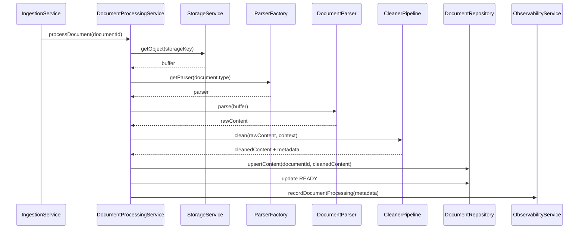

# TASK-027 Sequence

## 正常流程



## 清洗流程

```text
rawContent
-> normalize newline
-> remove invalid control characters
-> trim trailing whitespace outside code fence
-> compress blank lines outside code fence
-> detect h1/h2 outside code fence
-> add title heading if needed
-> validate non-empty content
-> return content + metadata
```

## 错误流程

### Parser 输出为空

```text
CleanerPipeline.clean()
-> BadRequestException
-> Document.status = FAILED
-> recordDocumentProcessing(status=failed)
```

### 清洗后为空

```text
MarkdownCleaner
-> BadRequestException("Document content is empty after cleaning")
```

### 不支持的 Parser 类型

保持现状：

```text
ParserFactory.getParser()
-> BadRequestException
```

## Code Fence 规则

进入 code fence 的判断：

- 行 trim 后以 ` ``` ` 开头。
- 行 trim 后以 `~~~` 开头。

退出 code fence 使用相同的简单 fence 检测。

code fence 内：

- 不压缩连续空行。
- 不裁剪行首空白。
- 不重排内容。

code fence 外：

- 行尾空白会移除。
- 连续空行最多保留 2 行。

## Heading 规则

如果 code fence 外存在：

```text
# Title
## Section
```

则视为已有一级或二级标题。

如果只存在：

```text
### Subsection
```

仍然添加：

```text
# {document.title}
```

## Metadata 规则

metadata 只记录数字和布尔值：

```ts
{
  inputLength: number;
  outputLength: number;
  removedCharacterCount: number;
  addedTitleHeading: boolean;
}
```

不得记录正文。
